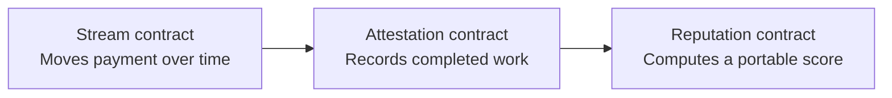

# Aven

**A protocol for streaming payments, portable work attestations, and on-chain reputation on Stellar.**

Aven turns economic activity into verifiable work history. Payments stream as work happens; completed streams create attestations; those attestations become a portable reputation record owned by the worker.

The repository contains the Aven web app, its editorial GSAP-powered landing page, three Soroban smart contracts, and generated TypeScript contract bindings.

## How it works



- **Stream** — creates, pauses, resumes, cancels, and settles time-based USDC or XLM payments.
- **Attestation** — mints a permanent work record from a completed stream.
- **Reputation** — calculates a score and category breakdown from verified attestations.

## Product surfaces

- `/` — monochrome editorial landing page with a GSAP layered-pinning scroll loop
- `/dashboard` — sent and received payment streams
- `/stream/create` — create a new stream
- `/stream/[id]` — inspect and manage a stream
- `/profile/[address]` — public work history and reputation
- `/verify` — verify an attestation or reputation claim
- `/agents` — agent-oriented protocol surface

## Tech stack

- Next.js 15, React 19, and TypeScript
- GSAP, ScrollTrigger, and `@gsap/react`
- Stellar SDK and Freighter wallet
- Soroban smart contracts written in Rust
- Generated TypeScript clients for each contract
- Mantine primitives and Lucide icons

## Run locally

### Prerequisites

- Node.js 20 or newer
- npm
- [Freighter](https://www.freighter.app/) configured for Stellar testnet to use wallet features
- Rust and the `wasm32v1-none` target only if you plan to build or test the contracts

### Start the web app

```bash
npm install
npm run dev
```

Open [http://localhost:3000](http://localhost:3000).

The current testnet RPC endpoint, network passphrase, and asset contract IDs are defined in `lib/contracts.ts`. Deployed contract IDs are stored in the generated clients under `bindings/*/src/index.ts`; no `.env` file is required for the checked-in testnet deployment.

## Validation

```bash
npm run typecheck
npm run build
```

Contract tests run from the Rust workspace:

```bash
cd contracts
cargo test
```

To build the contract WASM artifacts:

```bash
rustup target add wasm32v1-none
cd contracts
cargo build --target wasm32v1-none --release
```

## Repository structure

```text
app/                    Next.js routes and global styles
bindings/               Generated TypeScript clients for deployed contracts
components/             Wallet, navigation, app shell, and landing sections
components/sections/    Aven protocol panels and infinite layered loop
contracts/              Soroban Rust workspace
  contracts/stream_contract/
  contracts/attestation_contract/
  contracts/reputation_contract/
  contracts/shared/
lib/contracts.ts        Testnet config and contract client factories
lib/stellar.ts          Wallet and on-chain application operations
```

## Testnet deployment

The frontend is currently wired to Stellar testnet:

| Contract | Address |
| --- | --- |
| Stream | `CCPHFGDKV2SOL5SUFN3WPM7DVNMYAJODH63YIA2VCS5UFRW57Z7FNKJ4` |
| Attestation | `CDZMWG7BEGRIGKDXZE32NNQB37LRQQJ6657JOJOPNSOLSXHSKDSFMVL7` |
| Reputation | `CBAJXRTE37SREIBIL5FP3J6BJV2VTMCHHQJJIS5W4IQK4BZ6UANKGSVL` |

Amounts use Stellar's seven-decimal fixed-point representation. The frontend converts human-readable values at the client boundary in `lib/contracts.ts`.

## Development notes

- The landing-page loop is desktop-only. Mobile renders the same content as a normal stacked document flow.
- The duplicate final panel is an internal loop bridge and is excluded from pin and snap calculations.
- Freighter signs transactions in the browser; secret keys are never stored by the app.
- Contract bindings must be regenerated or updated after deploying a new contract version or changing a contract interface.

## Status

Aven is under active development and currently targets Stellar testnet. Do not treat testnet balances, attestations, or reputation scores as production records.
