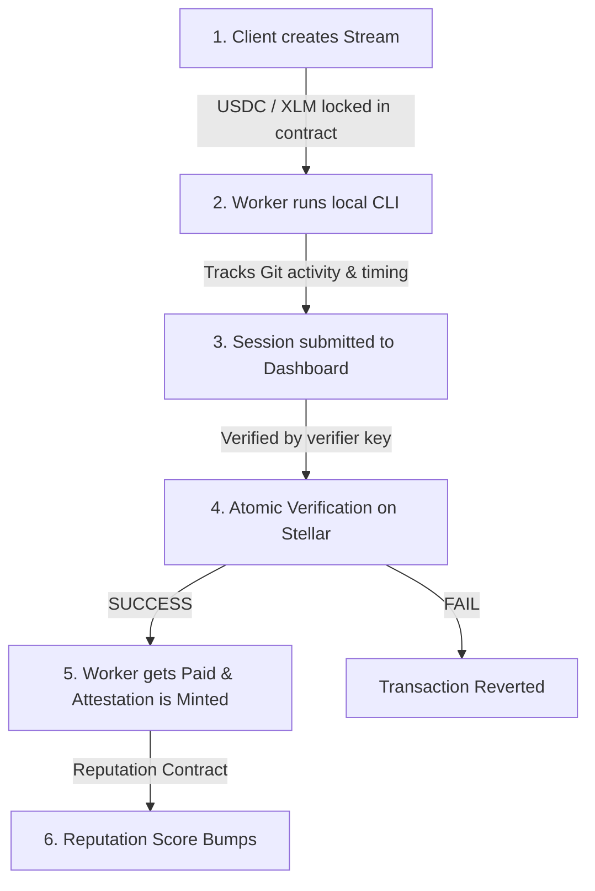

<div align="center">


 █████╗ ██╗   ██╗███████╗███╗   ██╗
██╔══██╗██║   ██║██╔════╝████╗  ██║
███████║██║   ██║█████╗  ██╔██╗ ██║
██╔══██║╚██╗ ██╔╝██╔══╝  ██║╚██╗██║
██║  ██║ ╚████╔╝ ███████╗██║ ╚████║
╚═╝  ╚═╝  ╚═══╝  ╚══════╝╚═╝  ╚═══╝


*Work flows in. Money flows out. Proof stays forever.*

Soroban · Stellar · 21-Day Build · Testnet Live

</div>
---
## 💡 What is Aven?

Aven is a protocol that allows clients to stream payments to workers as progress is made, while automatically documenting that progress as verifiable proof of work (attestations) on the Stellar ledger. These attestations roll up into a single, portable on-chain reputation score that workers own and can present anywhere.

### The Core Problem It Solves:
* **For Clients:** Prevents paying upfront for undelivered work. Clients can stream payments per second, with the ability to pause or dispute active sessions.
* **For Workers:** Guarantees payment for every active second of contribution. Eliminates payment delays and establishes a permanent, verifiable work history they own.
* **For AI Agents:** Provides a machine-to-machine payment and identity layer, allowing autonomous agents to earn, verify their output, and build reputation scores automatically.

---

## 🔄 How it Works: The Lifecycle



### 1. Payment Streaming
A client creates a payment stream on-chain (using USDC or XLM) with a specified total amount, duration, and rate per second. Funds are safely locked in the `stream_contract`.

### 2. Work Tracking (Privacy-First)
The worker launches the lightweight `aven-stellar` CLI tool in their local Git repository. The CLI monitors active time and Git statistics (files modified, branch, commits, and diff sizes). **It never reads file contents, uploads proprietary source code, or collects keystrokes.**

### 3. Submission & Verification
When the work period ends, the worker stops the session. The CLI generates a secure JSON report and uploads it to the Aven Dashboard. A verifier (automated or manual) validates the session's Git statistics against the requested payment.

### 4. Atomic Execution (Non-Negotiable Rule)
When the verified session is claimed:
* The `stream_contract` performs the token transfer to the worker.
* In the **same transaction**, the `attestation_contract` mints a permanent on-chain `AttestationRecord`.
* **If the payment transfer fails, no attestation is minted. If the attestation mint fails, the transaction reverts and the worker receives no money.** They are unified atomically.

### 5. Reputation Aggregation
The `reputation_contract` scans all minted attestations for the worker's address and computes a categorized reputation score (Freelance, Salary, Bounty, Grant, AgentTask, Subscription) based on actual volumes paid.

---

## 🌟 Key Features

* **Atomic Payments & Credit:** A worker is paid only when an attestation is created, and an attestation is created only when payment succeeds.
* **USDC & XLM Native Support:** Fund streams using either Stellar USDC or native XLM.
* **Privacy-First Git Verification:** Verifiable proof of contribution without exposing intellectual property or source code.
* **Category-Based Reputation:** Track expertise across different payment structures (e.g. high freelance score vs. high bounty score).
* **AI Agent Ready:** Built with machine-to-machine APIs to support fully autonomous agent workers.
* **High-Fidelity Editorial UI:** Desktop landing page using custom GSAP pinning transitions, styling, and animations.

---

## 💻 Tech Stack

* **Frontend:** Next.js 15 (App Router), React 19, TypeScript
* **Animations & Style:** GSAP (GreenSock), ScrollTrigger, `@gsap/react`, Vanilla CSS with Mantine primitives
* **Smart Contracts:** Soroban (Rust) smart contracts deployed on Stellar Testnet
* **SDK & Wallets:** Stellar SDK (`@stellar/stellar-sdk`), Freighter Wallet integration
* **CLI Tool:** Node.js 20+ CLI package (`aven-stellar`)

---

## 🚀 Running Locally

### Prerequisites
* **Node.js:** v20.x or newer
* **Stellar Freighter Wallet:** Installed in browser and configured for **Testnet** with a funded account.
* **Stellar CLI:** Only if building/deploying smart contracts.

### 1. Start the Web App
Install all dependencies and run the Next.js dev server:
```bash
npm install
npm run dev
```
Open [http://localhost:3000](http://localhost:3000).

### 2. Connect Your CLI
Inside any active Git repository where you want to perform work:
```bash
# Start a work session (will prompt you to authorize your wallet in the browser)
npx aven-stellar start --stream <your-stream-id>

# ... Work normally, commit code ...

# Stop the work session and submit the report to the dashboard
npx aven-stellar stop
```

---

## 📁 Repository Structure

```text
app/                     # Next.js routes and layout configurations
components/              # UI components, wallet providers, and layout shells
components/sections/     # GSAP-powered protocol showcases & infinite landing loop
contracts/               # Soroban Rust contracts & TypeScript bindings
  contracts/shared/      # Common types shared between contracts
  contracts/stream_contract/      # Stream payment and release logic
  contracts/attestation_contract/ # Attestation minting logic
  contracts/reputation_contract/  # Reputation score calculation
lib/                     # Client factories, Stellar wrappers, and utils
packages/                # Source code for the published CLI npm package
```

---

## 🌍 Testnet Deployment

The protocol contracts are currently live on **Stellar Testnet**:

| Contract | Address |
| --- | --- |
| **Stream Contract** | `CAZSE5UHSWNF62K26OZKOL7BSFB2647CXRPOICHUDCUJ5EKS4NCOA6ZA` |
| **Attestation Contract** | `CD22NZLAI53Y2LZB2GNLVITQXZWGZ3AQ6QKVKNUDKWABIIQIDEFSPQCG` |
| **Reputation Contract** | `CANK4E7GOFZT4D3U57RNT7QLQTNFGY7QNL6TQTWWKYBNHX7J6U54HO7E` |

---

## 🔒 Security & Verification
All work-session payouts are verified cryptographically. The Aven dashboard uses an automated verifier signature generated from the private `AVEN_VERIFIER_SECRET`. Any manual claim verifies this signature on-chain before executing the payout.

---

## 👥 Contributing & Branches

To contribute to Aven, please work on your feature branches (such as `pinky`) and open a Pull Request to the main branch.

