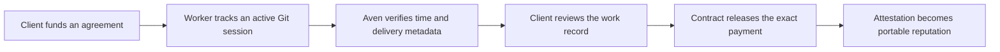

# Aven

**Pay for verified work. Keep the proof.**

[Live application](https://aven-chi.vercel.app/) ·
[Documentation](https://heyaven09.mintlify.site/) ·
[`aven-stellar` on npm](https://www.npmjs.com/package/aven-stellar)

Aven is a Stellar-based protocol for funding work, measuring active delivery,
releasing exact payments, and building portable on-chain reputation.

Clients lock a project budget in a smart contract. Workers track privacy-conscious
Git work sessions with the `aven-stellar` CLI. Each approved session releases the
amount justified by the recorded active time and leaves a verifiable attestation.

> **Project status:** feature-complete for the current Stellar testnet scope. The
> repository is in maintenance mode; future changes are focused on fixes and
> operational improvements.

## What Aven includes

- Funded XLM and USDC work agreements on Stellar testnet
- Exact payment reservation based on verified active seconds and the stream rate
- Worker submission, client review, approval, dispute, and release flows
- Final-project sessions with connected GitHub branch and commit verification
- Portable work attestations and address-based reputation
- Freighter wallet authentication without storing wallet secret keys
- A privacy-conscious npm CLI that never uploads complete source files
- Shared production persistence through Upstash Redis

## How it works



1. A client creates a stream with a recipient, asset, budget, duration, and work
   verification type.
2. The recipient authorizes the local CLI by signing a short-lived device request
   with Freighter.
3. `aven-stellar` records active time and Git change statistics inside the selected
   repository.
4. The worker submits a reviewable work-session report to the matching stream.
5. The configured verifier reserves the contract-enforced payment amount.
6. The client approves or disputes the session. Approved work releases payment and
   creates a permanent proof record.

## Product surfaces

| Route | Purpose |
| --- | --- |
| `/` | Aven landing page and protocol overview |
| `/dashboard` | Sent and received payment streams |
| `/stream/create` | Guided four-step agreement creation |
| `/stream/[id]` | Stream funding, work sessions, review, and release |
| `/profile/[address]` | Public work attestations and reputation |
| `/verify` | Independent on-chain attestation verification |
| `/agents` | Reputation lookup for human or automated workers |
| `/cli/authorize` | Wallet-signed local CLI authorization |
| `/register-sender` | Sender identity registration |

## Tech stack

- Next.js 15, React 19, and TypeScript
- Stellar SDK, Freighter, and generated Soroban clients
- Rust smart contracts using the Soroban SDK
- GSAP and `@gsap/react` for focused landing-page motion
- Upstash Redis for production session and authorization state
- GitHub App and OAuth integrations for delivery verification
- Mantine primitives and Lucide icons

## Quick start

### Requirements

- Node.js 20 or newer
- npm
- [Freighter](https://www.freighter.app/) configured for Stellar testnet
- Rust and the `wasm32v1-none` target only when working on contracts

### Run the web application

```bash
git clone https://github.com/kartikeywastaken/aven-ste.git
cd aven-ste
npm install
cp .env.example .env.local
npm run dev
```

Open [http://localhost:3000](http://localhost:3000).

The application will render without a connected wallet, but stream, attestation,
reputation, and verifier operations require the corresponding testnet contract IDs
and server signer.

## Environment variables

Never commit `.env.local`, wallet secret keys, GitHub secrets, or Redis tokens.

### Stellar contracts

| Variable | Scope | Purpose |
| --- | --- | --- |
| `NEXT_PUBLIC_STREAM_CONTRACT_ID` | Public | Deployed stream contract |
| `NEXT_PUBLIC_ATTESTATION_CONTRACT_ID` | Public | Deployed attestation contract |
| `NEXT_PUBLIC_REPUTATION_CONTRACT_ID` | Public | Deployed reputation contract |
| `AVEN_VERIFIER_SECRET` | Server only | Signs verified work claims |

The application currently uses Stellar testnet RPC, Horizon, network passphrase,
native XLM SAC, and testnet USDC configuration from
[`lib/contracts.ts`](./lib/contracts.ts).

### Persistence

| Variable | Required | Purpose |
| --- | --- | --- |
| `UPSTASH_REDIS_REST_URL` | Production | Shared Redis REST endpoint |
| `UPSTASH_REDIS_REST_TOKEN` | Production | Shared Redis credential |
| `AVEN_DATA_NAMESPACE` | Optional | Explicit deployment data namespace |
| `AVEN_SESSION_STORE` | Local only | File-backed work-session store |
| `AVEN_CLI_TOKEN_STORE` | Local only | File-backed CLI authorization store |

Local development can use the file-backed stores under `data/`. Production should
use Redis so work sessions and CLI authorizations remain available across devices
and serverless instances. When `AVEN_DATA_NAMESPACE` is omitted, the stream contract
ID is used so a fresh deployment starts with a clean data set.

### GitHub integration

| Variable | Purpose |
| --- | --- |
| `GITHUB_APP_ID` | GitHub App numeric ID |
| `GITHUB_APP_PRIVATE_KEY` | GitHub App RSA private key |
| `GITHUB_APP_INSTALLATION_ID` | Installed Aven organization instance |
| `GITHUB_WEBHOOK_SECRET` | Validates GitHub webhook requests |
| `GITHUB_AVEN_ORG` | Organization that owns connected repositories |
| `GITHUB_OAUTH_CLIENT_ID` | Worker account linking |
| `GITHUB_OAUTH_CLIENT_SECRET` | OAuth server credential |
| `GITHUB_OAUTH_REDIRECT_URI` | Registered callback URL |

For Vercel or another single-line environment editor, store the private key in one
value and replace its literal line breaks with `\n`. The server normalizes escaped
newlines before creating the GitHub App client.

Use this callback in production:

```text
https://your-domain.example/api/github/callback
```

Use this callback locally:

```text
http://localhost:3000/api/github/callback
```

## Work-session CLI

[`aven-stellar`](https://www.npmjs.com/package/aven-stellar) is the published
Node.js CLI. The current package version in this repository is `0.3.0`, and it
installs both `aven` and `aven-stellar` command aliases.

Run it without a global installation:

```bash
npx aven-stellar start

# Work normally in the connected Git repository.

npx aven-stellar stop
```

Or install it globally:

```bash
npm install --global aven-stellar
aven start
aven stop
```

### Useful options

```bash
npx aven-stellar start --stream <stream-id> --dashboard <url>
npx aven-stellar start --non-interactive
npx aven-stellar stop --message "Implemented the assigned changes"
npx aven-stellar stop --submit
npx aven-stellar stop --ended
```

- `start --non-interactive` skips the collection confirmation.
- `stop --message` includes a worker-written delivery summary.
- `stop --submit` submits the previewed report without a second prompt.
- `stop --ended` marks the session as final, verifies selected delivery branches
  against the connected GitHub repository, and prepares the remaining unreserved
  escrow for client-approved release.

On first use, `start` asks for the dashboard URL and stream ID, opens
`/cli/authorize`, and asks the stream recipient to sign with Freighter. The resulting
token can read that worker's streams, submit sessions, and request review. It cannot
create streams or approve the worker's own request.

If a stopped session fails to submit, run `stop` again. The CLI keeps the original
stop time and retries the same report instead of counting the delay as work.

### Privacy boundary

The CLI records:

- session start, stop, and active time;
- branch and commit metadata;
- relative changed paths;
- additions, deletions, and Git status; and
- the worker's delivery statement.

It does **not**:

- request or store Stellar secret keys;
- execute the tracked project, tests, or scripts;
- install project dependencies;
- record keystrokes or screenshots;
- upload complete source files; or
- read paths excluded by `.gitignore` or `.avenignore`.

Recoverable local state is stored under `.aven/`. Do not commit that directory.

## Payment enforcement

For a normal session, the verifier reserves:

```text
verified active seconds × stream rate
```

The amount is capped by the stream's unreserved escrow, and the smart contract
independently checks the calculation. Workers never enter their own payment amount.

For `--ended`, the server converts the remaining escrow into a
contract-compatible duration while preserving the real npm-tracked active seconds
in the report. Pending or reserved payments must be resolved before a final session
can be submitted. Final release still requires explicit client review in the web
application.

## Validation

Run the application checks:

```bash
npm run typecheck
npm test
npm run build
```

Run the CLI package tests:

```bash
npm --prefix packages/aven-work-session test
```

Run the contract tests:

```bash
cd contracts
cargo test --workspace
```

Build the stream contract:

```bash
rustup target add wasm32v1-none
cd contracts
stellar contract build --package stream_contract
```

## Repository structure

```text
app/                            Next.js routes, APIs, and product styles
components/                     Wallet, navigation, shell, and landing UI
contracts/                      Soroban Rust workspace
  bindings/                     Generated TypeScript contract clients
  contracts/stream_contract/    Escrow and verified-release logic
  contracts/attestation_contract/
  contracts/reputation_contract/
  contracts/shared/
lib/                            Stellar clients, persistence, GitHub, and verification
packages/aven-work-session/     Published aven-stellar CLI source and tests
scripts/                        Data migration utilities
```

## Deployment

The web application is designed for Vercel or another Next.js-compatible platform.

1. Deploy the contracts and configure all three public contract IDs.
2. Add `AVEN_VERIFIER_SECRET` as a protected server-only variable.
3. Configure Upstash Redis for shared production state.
4. Add the GitHub App, OAuth, and webhook variables when delivery verification is
   enabled.
5. Register the production GitHub OAuth callback URL.
6. Run `npm run build` before promoting the deployment.

Amounts use Stellar's seven-decimal fixed-point representation. Human-readable
values are converted at the client boundary in `lib/contracts.ts`.

## Security notes

- Freighter signs browser transactions; the app never stores a user's wallet secret.
- `AVEN_VERIFIER_SECRET`, Redis credentials, and GitHub secrets must remain
  server-only.
- CLI device authorization is wallet-signed, scoped, and short-lived.
- Contract bindings must be regenerated after changing or redeploying a contract
  interface.
- Testnet balances, attestations, and reputation records are not production assets.

## License

No license has been declared for this repository.
