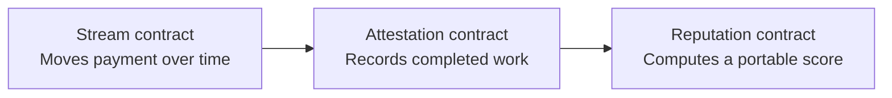

# Aven

**A protocol for streaming payments, portable work attestations, and on-chain reputation on Stellar.**

Aven turns economic activity into verifiable work history. Payments stream as work happens; completed streams create attestations; those attestations become a portable reputation record owned by the worker.

The repository contains the Aven web app, its editorial GSAP-powered landing page, the Aven protocol contracts, generated TypeScript bindings, and the `aven-stellar` work-session package. The enhanced stream build is ready for its first testnet deployment.

## How it works



- **Stream** — creates, pauses, resumes, cancels, and settles time-based USDC or XLM payments.
- **Verified releases** — an optional stream extension that ties exact session payments to verifier records, client review, and timeout release.
- **Attestation** — mints a permanent work record from a completed stream.
- **Reputation** — calculates a score and category breakdown from verified attestations.

## Product surfaces

- `/` — monochrome editorial landing page with a GSAP layered-pinning scroll loop
- `/dashboard` — sent and received payment streams
- `/stream/create` — create a new stream
- `/stream/[id]` — inspect and manage a stream
- `/profile/[address]` — public work history and reputation
- `/verify` — verify an attestation or reputation claim
- `/agents` — on-chain reputation lookup for human and AI workers
- `/cli/authorize` — wallet-signed authorization for the local work-session CLI
- `/stream/[id]` — also contains the client/worker work-session review ledger

## Tech stack

- Next.js 15, React 19, and TypeScript
- GSAP, ScrollTrigger, and `@gsap/react`
- Stellar SDK and Freighter wallet
- Soroban smart contracts written in Rust
- Generated TypeScript clients for each contract
- Mantine primitives and Lucide icons

## Run locally

### Prerequisites

- Node.js 20 or newer
- npm
- [Freighter](https://www.freighter.app/) configured for Stellar testnet to use wallet features
- Rust and the `wasm32v1-none` target only if you plan to build or test the contracts

### Start the web app

```bash
npm install
npm run dev
```

Open [http://localhost:3000](http://localhost:3000).

The current testnet RPC endpoint, network passphrase, and asset contract IDs are defined in `lib/contracts.ts`. Deployed contract IDs are stored in the generated clients under `contracts/bindings/*/src/index.ts`; no `.env` file is required for the checked-in testnet deployment.

## Validation

```bash
npm run typecheck
npm run build
```

Contract tests run from the Rust workspace:

```bash
cd contracts
cargo test
```

## Work sessions

[`aven-stellar`](https://www.npmjs.com/package/aven-stellar) is the published CLI that connects Git activity to an existing Aven stream without executing project code or collecting full file contents. It requires Node.js 20 or newer and must be run inside a Git repository:

```bash
npx aven-stellar start

# After working in the connected repository:
npx aven-stellar stop
```

For a global installation, run `npm install --global aven-stellar` and use `aven start` / `aven stop`. Both `aven` and `aven-stellar` are installed as command aliases.

On first use, `start` asks for the Aven dashboard URL and stream ID, opens `/cli/authorize`, and asks the stream recipient to sign a short-lived device authorization with Freighter. For local development, use `http://localhost:3000` as the dashboard URL. The resulting token can read that worker's streams, submit sessions, and request review; it cannot create streams or approve the worker's own request.

The CLI creates `.avenignore` with private-file defaults, records relative paths and Git statistics, and stores recoverable local state under `.aven/`. `stop` calculates the session report and previews it before submission. Submitted sessions appear in the `WORK SESSIONS` section on `/stream/[id]`, where the worker can request review and the stream sender can approve or dispute the request.

The report contains session timing, branch and commit metadata, file-level change statistics, and the worker's statement. Its payment amount is calculated automatically from tracked active seconds and the stream's on-chain rate, capped by currently earned funds; workers do not enter their own amount. The report does not contain complete source files, keystrokes, screenshots, environment files, wallet secret keys, or excluded paths. The CLI never executes the tracked project or installs its dependencies.

The next stream deployment keeps the original Aven interface and adds verified work releases to it. Existing stream creation, checkpoints, attestations, reputation inputs, indexes, pause/resume/cancel, and client methods remain available. The optional verifier records an exact session amount and evidence on the same stream before the existing approval/dispute/timeout withdrawal flow begins. The dashboard uses `NEXT_PUBLIC_STREAM_CONTRACT_ID`, while the server signs verification with `AVEN_VERIFIER_SECRET`.

To build the contract WASM artifacts:

```bash
rustup target add wasm32v1-none
cd contracts
stellar contract build --package stream_contract
```

## Repository structure

```text
app/                    Next.js routes and global styles
components/             Wallet, navigation, app shell, and landing sections
components/sections/    Aven protocol panels and infinite layered loop
contracts/              Soroban Rust workspace
  bindings/             Generated TypeScript clients for deployed contracts
  contracts/stream_contract/
  contracts/attestation_contract/
  contracts/reputation_contract/
  contracts/shared/
lib/contracts.ts        Testnet config and contract client factories
lib/stellar.ts          Wallet and on-chain application operations
packages/aven-work-session/ Source for the published `aven-stellar` CLI
```

## Testnet deployment

The frontend is currently wired to Stellar testnet:

| Contract | Address |
| --- | --- |
| Stream | `CCPHFGDKV2SOL5SUFN3WPM7DVNMYAJODH63YIA2VCS5UFRW57Z7FNKJ4` |
| Attestation | `CDZMWG7BEGRIGKDXZE32NNQB37LRQQJ6657JOJOPNSOLSXHSKDSFMVL7` |
| Reputation | `CBAJXRTE37SREIBIL5FP3J6BJV2VTMCHHQJJIS5W4IQK4BZ6UANKGSVL` |

Amounts use Stellar's seven-decimal fixed-point representation. The frontend converts human-readable values at the client boundary in `lib/contracts.ts`.

## Development notes

- The landing-page loop is desktop-only. Mobile renders the same content as a normal stacked document flow.
- The duplicate final panel is an internal loop bridge and is excluded from pin and snap calculations.
- Freighter signs transactions in the browser; secret keys are never stored by the app.
- AI agents participate as workers: their wallet address is the recipient of an ordinary Aven payment stream.
- Contract bindings must be regenerated or updated after deploying a new contract version or changing a contract interface.

## Status

Aven is under active development and currently targets Stellar testnet. Do not treat testnet balances, attestations, or reputation scores as production records.
